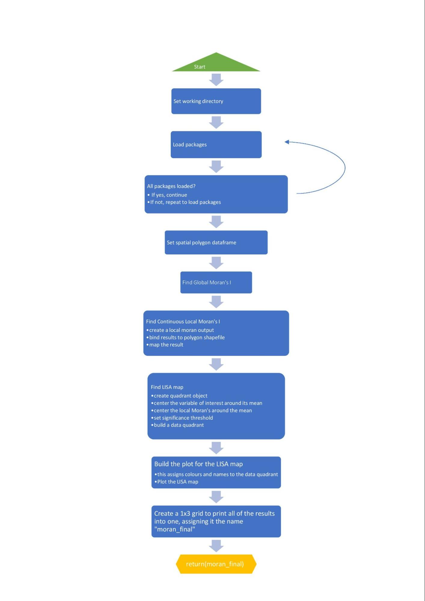
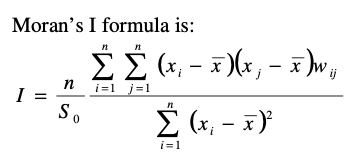

# POLS0010 — Part 1: Function Design

This project focused on writing and testing a custom R function for spatial analysis as part of the POLS0010 module.

## 📄 Report
See the full report here:
- [POLS0010 Part 1 PDF](reports/POLS0010%20Part%201.pdf)

## 💻 Code
All R scripts are in the [`/code`](code/) folder.

## 🖼️ Figures
Example outputs and flowcharts are in [`/figures`](figures/):

---
